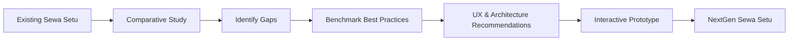
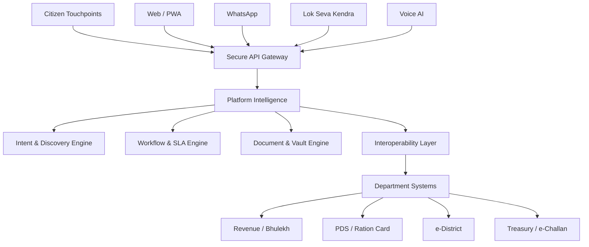
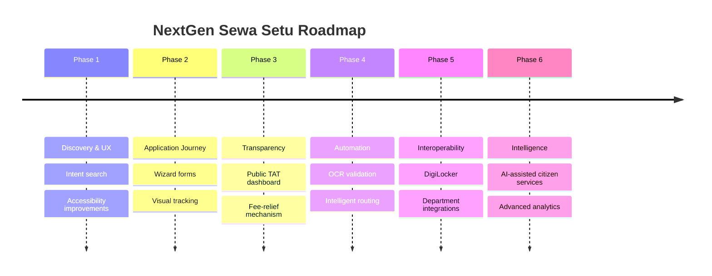

#  Reimagining Chhattisgarh Sewa Setu

### 🚀 A Citizen-Centric Digital Governance Experience

**Sewa Setu Innovation Hackathon — Problem Statement 3**
**Team Neural Ninjas | IIIT Naya Raipur × CHiPS**

> **Making government services easier to discover, easier to access, easier to track, and more accessible to every citizen.**

---

## ✨ Project Overview

**Reimagining Chhattisgarh Sewa Setu** is an interactive research, UX, and technology prototype developed for **Problem Statement 3: Comparative Study of Sewa Setu**.

The project studies citizen-service platforms across Indian states and translates identified patterns into a proposed **NextGen Sewa Setu experience** focused on:

* 🔎 Intent-based service discovery
* 📊 Transparent SLA and turnaround-time tracking
* ♿ Accessibility-first design
* 🌐 Multilingual citizen interaction
* 📄 Reduced repetitive document submission
* 🔗 Digital Public Infrastructure interoperability
* 🤖 AI-assisted service discovery and document processing
* 📱 Mobile-first citizen services

Instead of presenting the research as a static document, this project turns it into an **interactive web-based presentation and research portal**.

---

## 🎯 Problem Statement

Citizens interacting with government portals can face challenges such as:

| Challenge                                    | Proposed Direction                                 |
| -------------------------------------------- | -------------------------------------------------- |
| 🔍 Difficult service discovery               | Intent-based search                                |
| ⏳ Limited visibility of application progress | Visual application timeline                        |
| 📄 Repeated document uploads                 | DigiLocker integration                             |
| 💰 Uniform application fees                  | PDS-linked fee-relief mechanism                    |
| 🏢 Department-based navigation               | Citizen/life-event-based discovery                 |
| ♿ Accessibility barriers                     | Font scaling, high contrast & multilingual support |
| ⚠️ Delayed applications                      | SLA monitoring & escalation                        |
| 🌐 Language barriers                         | Multilingual and voice-based interaction           |

---

# 🧠 Our Approach



### 🔬 Comparative Study

The project benchmarks Chhattisgarh Sewa Setu against citizen-service platforms including:

* 🇮🇳 Goa Online
* 🇮🇳 Kerala e-District
* 🇮🇳 Delhi e-District
* 🇮🇳 Karnataka Seva Sindhu
* 🇮🇳 Odisha One
* 🇮🇳 Assam Sewa Setu

The study translates observed practices into actionable recommendations for Chhattisgarh.

---

# 🌟 Interactive Project Modules

The website is structured as an interactive research and presentation portal.

### 01 · 🎞️ 28-Slide Pitch Deck

An interactive presentation system with:

* Previous / Next navigation
* Slide selector
* Quick slide thumbnails
* Speaker notes
* Citation references
* Dynamic slide rendering

---

### 02 · 📋 Executive Summary

A structured overview containing:

* Current Sewa Setu context
* Key findings
* Identified gaps
* Existing capabilities
* Proposed improvements
* Strategic recommendations

---

### 03 · 📊 50-Feature Comparative Matrix

Compare multiple citizen-service portals across feature dimensions.

**Includes:**

* Search functionality
* Accessibility
* Application tracking
* SLA transparency
* Document handling
* Digital integrations
* Citizen communication
* Service discovery
* And other benchmark dimensions

🔎 **Interactive search** allows users to filter features such as:

`SLA` · `WhatsApp` · `DigiLocker` · `Accessibility` · `Tracking`

---

### 04 · 👥 Citizen Personas & Journey Mapping

Understand how different citizens interact with digital government services.

The module explores:

```text
Citizen
   ↓
Need Identification
   ↓
Service Discovery
   ↓
Eligibility
   ↓
Application
   ↓
Document Submission
   ↓
Verification
   ↓
Application Tracking
   ↓
Service Delivery
```

The goal is to identify friction points and design around actual citizen journeys.

---

### 05 · 🎨 NextGen UI Prototype

The project includes interactive UI concepts for:

#### 🏠 Homepage

Citizen-focused landing experience.

#### 🔎 Service Discovery Wizard

A simplified:

> **"What do you need?"**

approach instead of forcing citizens to understand government departments.

#### 📑 Service Details & Eligibility

Provides users with relevant information before beginning an application.

#### 📦 Visual Timeline Tracker

An application journey inspired by familiar package-tracking experiences.

#### 📱 Mobile-First PWA Concept

A responsive experience designed around mobile citizens.

---

### 06 · 📈 Public & Admin SLA Dashboard

An interactive dashboard concept for monitoring service delivery.

Includes:

* 📥 Monthly applications
* ⏱️ SLA compliance
* ⚠️ SLA breaches
* 📊 Average turnaround time
* 🗺️ District-level monitoring
* 📉 Verification-stage bottlenecks
* 📱 Service delivery channel analysis

District filtering is also included for:

`Raipur` · `Durg` · `Bilaspur` · `Bastar` · `Surguja`

---

### 07 · 🏗️ Proposed System Architecture

The proposed architecture follows a layered approach:



### Core proposed engines

| Engine                       | Purpose                          |
| ---------------------------- | -------------------------------- |
| 🔎 Intent & Discovery Engine | Understand citizen requirements  |
| ⏱️ Workflow & SLA Engine     | Monitor application timelines    |
| 📄 Document & Vault Engine   | Handle digital documents         |
| 🌐 Interoperability Layer    | Connect departmental systems     |
| 🗣️ Language Layer           | Support multilingual interaction |

---

# ♿ Accessibility First

Accessibility is treated as a core part of the proposed experience rather than an optional feature.

### Included in the prototype

* 🔠 Font size controls
* 🌓 High-contrast mode
* 🌐 English
* 🇮🇳 Hindi
* 🟠 Chhattisgarhi
* 📱 Responsive interface
* 🗣️ Voice-oriented interaction concepts
* 👴 Senior-friendly larger text options

The prototype implements font scaling and a high-contrast interface directly in the frontend.

---

# 🛠️ Technology Stack

### Frontend


### UI & Visualization


### Design & UX

* 🎨 Citizen-centric UI/UX
* 📱 Responsive design
* ♿ Accessibility controls
* 🧩 Component-based interactive sections
* 📊 Data visualization
* 🗺️ Journey mapping

---

# 💡 Key Innovation

The central idea is to shift the citizen experience from:

```text
"Which department handles my problem?"
```

to:

```text
"What do you need?"
        ↓
Understand the citizen's intent
        ↓
Identify relevant service
        ↓
Check eligibility
        ↓
Retrieve available documents
        ↓
Submit application
        ↓
Track progress visually
        ↓
Receive service
```

This reduces the amount of government-system knowledge a citizen needs before starting an application.

---

# 🗺️ Proposed Implementation Roadmap



---

# 📁 Project Structure

```text
Sewa-Setu-Neural-Ninjas/
│
├── index.html
│
├── README.md
│
└── assets/
    ├── images/
    ├── logos/
    └── screenshots/
```

> If the current HTML file is retained with its original filename, it can also be opened directly as the project entry point.

---

# 🚀 Getting Started

## 1️⃣ Clone the repository

```bash
git clone <your-repository-url>
cd Sewa-Setu-Neural-Ninjas
```

## 2️⃣ Open the project

Since the current prototype is implemented as a frontend web application, no backend server is required for the basic demo.

Simply open:

```text
index.html
```

in a modern browser.

### Recommended

Use **VS Code + Live Server** for the smoothest development experience.

```text
VS Code
   ↓
Open Project
   ↓
Open index.html
   ↓
Run with Live Server
   ↓
Explore the interactive prototype 🚀
```

---

# 🎮 How to Explore the Demo

### Start with

**🎞️ 28-Slide Pitch Deck**

Then explore:

```text
Executive Summary
        ↓
50-Feature Matrix
        ↓
Personas & Journeys
        ↓
NextGen UI Prototype
        ↓
SLA Dashboard
        ↓
Architecture & Roadmap
        ↓
Official References
```

### Try these interactions

* Navigate through the presentation
* Search the feature matrix
* Switch citizen personas
* Explore different prototype screens
* Switch between high-fidelity and wireframe views
* Change font size
* Enable high contrast
* Change language
* Filter dashboard data by district
* Explore architecture and implementation phases

---

# 📊 Expected Impact

The proposed experience is designed around four major outcomes:

| 🎯 Goal             | Expected Direction                                    |
| ------------------- | ----------------------------------------------------- |
| 🔎 Discoverability  | Help citizens find services using natural language    |
| ⏱️ Transparency     | Make application progress and SLA performance visible |
| ♿ Inclusion         | Improve accessibility and multilingual interaction    |
| 🔗 Interoperability | Reduce repeated data and document submission          |

The broader proposal aims to make digital public services more **citizen-centric, transparent, accessible, and interoperable**.

---

# 🏆 Hackathon Deliverables

This project combines multiple deliverables into one interactive platform:

* ✅ Comparative study
* ✅ State-wise benchmarking
* ✅ Feature comparison matrix
* ✅ Citizen personas
* ✅ Journey mapping
* ✅ UX recommendations
* ✅ High-fidelity UI concepts
* ✅ Low-fidelity wireframe index
* ✅ SLA dashboard concept
* ✅ System architecture
* ✅ Implementation roadmap
* ✅ Official reference section
* ✅ Interactive presentation deck

---

# 👨‍💻 Team Neural Ninjas

### 🧠 Team

| Member               | Program    |
| -------------------- | ---------- |
| **Vaishnavi Satone** | M.Tech CSE |
| **Ojus Chauhan**     | M.Tech CSE |
| **Ashish Verma**     | M.Tech CSE |

**Institution:** IIIT Naya Raipur

**Hackathon:** Sewa Setu Innovation Hackathon
**Problem Statement:** PS-03 — Reimagining Chhattisgarh Sewa Setu

---

# 🔍 Research Foundation

The project benchmarks citizen-service platforms and translates their observed capabilities into recommendations for Chhattisgarh Sewa Setu.

The research focuses particularly on:

* Service discovery
* SLA transparency
* Accessibility
* Digital documents
* Citizen journeys
* Interoperability
* Multilingual access
* Administrative monitoring

The prototype also includes a dedicated **Official Sources & References** section to document the research foundation.

---

# 📚 Reference Portals

The project references official government portals including:

* Chhattisgarh Sewa Setu
* Goa Online
* Kerala e-District
* Karnataka Seva Sindhu
* Odisha One
* Delhi e-District
* Government accessibility guidelines

> All benchmark findings and proposed capabilities should be interpreted as part of the hackathon's comparative-study and prototype context.

---

# 🔮 Future Scope

The prototype can be extended into a production-ready platform with:

### 🤖 AI

* Natural-language service discovery
* Eligibility assistance
* Intelligent document validation
* AI-powered citizen support

### 🔗 Integrations

* DigiLocker
* PDS databases
* Department databases
* Digital certificate systems

### 📊 Analytics

* Real-time SLA monitoring
* District-level performance analytics
* Bottleneck detection
* Automated escalation

### 📱 Citizen Experience

* Progressive Web App
* WhatsApp-based services
* Voice-first interaction
* Regional-language support
* Offline-friendly workflows

---

# ❤️ Why This Project?

Government portals should not require citizens to understand how government departments are organized.

A citizen should be able to explain **what they need** — and the system should help them discover **how to get it**.

> ### **From Department-Centric Navigation → Citizen-Centric Services**

---

## ⭐ Project Vision

### **One Portal. One Journey. One Citizen-Centric Experience.**

**Reimagining Chhattisgarh Sewa Setu for a simpler, more transparent and accessible digital governance experience.**

---

<div align="center">

### 🇮🇳 Built for Digital Public Service Innovation

**Neural Ninjas · IIIT Naya Raipur · Sewa Setu Innovation Hackathon**

⭐ **If you find the project interesting, consider giving the repository a star!** ⭐

</div>
